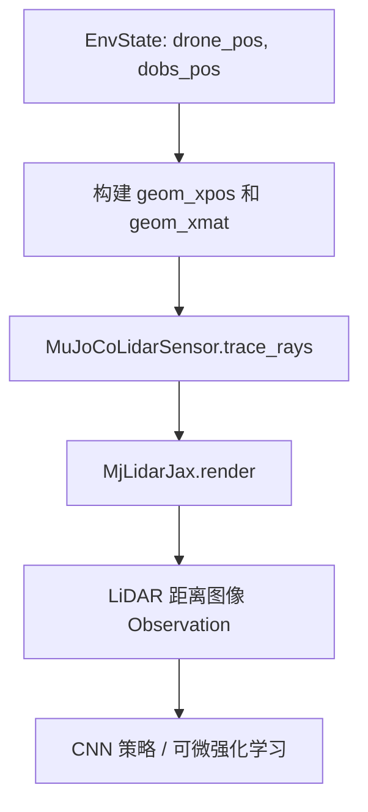

# MuJoCo-LiDAR JAX 后端 (MjLidarJax) 接入 Flightning 详细集成方案

在实现 [p2m-dynamic-avoidance-migration.md](file:///home/tong/tongworkspace/paperworkspace/rpg_flightning/docs/prd/p2m-dynamic-avoidance-migration.md) 的过程中，我们需要在 Flightning 的 JAX/JIT 兼容环境中实现**分段可微 LiDAR 几何**与**解析 LiDAR 梯度**。

本方案指导如何在 **`flightning` 纯 JAX 状态积分器/动力学**的前提下，使用 `MuJoCo-LiDAR` 的 [MjLidarJax](file:///home/tong/.gitnexus/repos/MuJoCo-LiDAR/src/mujoco_lidar/core_jax/mjlidar_jax.py) 模块作为 **JIT 兼容的可微分 LiDAR 深度图渲染器**。

---

## 架构概览

虽然 `flightning` 不使用 MuJoCo 作为其物理引擎，但由于 `MjLidarJax` 的射线-几何体相交计算（Raycasting）是纯数学实现的 JAX 函数，我们完全可以在每一步通过 JAX 数组动态传递场景状态，重用其高性能的 GPU 并行渲染能力。

整个集成流程如下：



---

## 详细集成步骤


---

### 第二步：定义场景描述 XML 文件
我们在 [flightning/sensors](file:///home/tong/tongworkspace/paperworkspace/rpg_flightning/flightning/sensors) 目录下新建一个 `avoidance_arena.xml`，用于向 `MjLidarJax` 声明我们的环境中有哪些静态几何体（墙壁）和动态几何体（障碍物）：

```xml
<mujoco model="avoidance_arena">
  <worldbody>
    <!-- 1. 静态边界墙壁 (示例：10m x 10m 的正方形区域) -->
    <!-- 静态位置 pos 和大小 size 必须与 PRD 设定的 Arena 保持一致 -->
    <geom name="wall_north" type="box" size="0.1 5.0 2.0" pos="5.0 0.0 1.0" />
    <geom name="wall_south" type="box" size="0.1 5.0 2.0" pos="-5.0 0.0 1.0" />
    <geom name="wall_east" type="box" size="5.0 0.1 2.0" pos="0.0 5.0 1.0" />
    <geom name="wall_west" type="box" size="5.0 0.1 2.0" pos="0.0 -5.0 1.0" />
    
    <!-- 2. 动态障碍物占位符 (与 PRD 中 N_obs 的数量匹配) -->
    <!-- 物理位置将由 JAX state 动态喂给渲染器，这里初始 pos 置零即可 -->
    <geom name="obs_0" type="cylinder" size="0.4 1.5" pos="0 0 1.5" />
    <geom name="obs_1" type="cylinder" size="0.4 1.5" pos="0 0 1.5" />
    <geom name="obs_2" type="cylinder" size="0.4 1.5" pos="0 0 1.5" />
    <geom name="obs_3" type="cylinder" size="0.4 1.5" pos="0 0 1.5" />
  </worldbody>
</mujoco>
```

---

### 第三步：在 Flightning 中编写传感器包装类
在 [flightning/sensors](file:///home/tong/tongworkspace/paperworkspace/rpg_flightning/flightning/sensors) 下创建新文件 `mujoco_lidar_sensor.py`，实现 `MuJoCoLidarSensor`。

```python
# file: flightning/sensors/mujoco_lidar_sensor.py
import os
import jax
import jax.numpy as jnp
import mujoco
from mujoco_lidar import MjLidarJax

class MuJoCoLidarSensor:
    def __init__(self, xml_path: str, num_obs: int, lidar_range: float = 10.0):
        # 1. 加载 MuJoCo Model 并构建 JAX 后端
        self.model = mujoco.MjModel.from_xml_path(xml_path)
        self.lidar = MjLidarJax(self.model)
        self.num_obs = num_obs
        self.lidar_range = lidar_range
        
        # 2. 静态墙壁几何参数 (提取自 XML)
        # 前 4 个是 Box 墙壁，其位置和旋转由 XML 确定，不随物理改变
        self.static_pos = jnp.array(self.model.geom_pos[:4]) # (4, 3)
        self.static_mat = jnp.array(self.model.geom_quat[:4]) # 或者转为旋转矩阵 (4, 3, 3)
        # 将静态四元数转换为 3x3 矩阵，或者直接用旋转表示
        # 示例简化为单位旋转：
        self.static_mat = jnp.tile(jnp.eye(3), (4, 1, 1))

        # 3. 构造 P2M 默认的扫描角度 (水平分辨率 36, 垂直分辨率 6)
        # 水平 FOV 360 度，垂直 FOV [-7, 52] 度
        theta_num, phi_num = 36, 6
        theta = jnp.linspace(-jnp.pi, jnp.pi, theta_num, endpoint=False)
        phi = jnp.radians(jnp.linspace(-7.0, 52.0, phi_num))
        
        # 得到一维角度数组用于 trace_rays
        theta_grid, phi_grid = jnp.meshgrid(theta, phi)
        self.ray_theta = theta_grid.flatten()
        self.ray_phi = phi_grid.flatten()

    def get_lidar_ranges(
        self, 
        drone_pos: jax.Array,        # (3,)
        drone_mat: jax.Array,        # (3, 3)
        dobs_pos: jax.Array,         # (N_obs, 2)
        dobs_height_center: float = 1.5,
        stop_gradient: bool = False
    ) -> jax.Array:
        """
        在 JAX step 中被调用以渲染激光雷达距离观测。
        支持两种视觉梯度模式。
        """
        # 1. 视情况阻断环境状态计算图梯度
        if stop_gradient:
            drone_pos = jax.lax.stop_gradient(drone_pos)
            drone_mat = jax.lax.stop_gradient(drone_mat)
            dobs_pos = jax.lax.stop_gradient(dobs_pos)

        # 2. 从环境状态组装所有 geoms 的位置与旋转 (前 4 为墙壁，后为动态圆柱体)
        obs_z = jnp.full((self.num_obs, 1), dobs_height_center)
        dynamic_pos = jnp.concatenate([dobs_pos, obs_z], axis=1) # (N_obs, 3)
        dynamic_mat = jnp.tile(jnp.eye(3), (self.num_obs, 1, 1)) # 圆柱体无旋转，单位阵

        geom_xpos = jnp.concatenate([self.static_pos, dynamic_pos], axis=0) # (4 + N_obs, 3)
        geom_xmat = jnp.concatenate([self.static_mat, dynamic_mat], axis=0) # (4 + N_obs, 3, 3)

        # 3. 调用 MjLidarJax 执行可微分求交渲染
        # 返回 ranges: (N_rays,)
        ranges, _ = self.lidar.trace_rays(
            geom_xpos=geom_xpos,
            geom_xmat=geom_xmat,
            sensor_pos=drone_pos,
            sensor_mat=drone_mat,
            ray_theta=self.ray_theta,
            ray_phi=self.ray_phi
        )
        
        # 4. 对未命中的射线限制为最大量程 (MjLidarJax 对未命中返回 0.0)
        ranges_clipped = jnp.where(ranges == 0.0, self.lidar_range, ranges)
        
        return ranges_clipped
```

---

### 第四步：在避障环境中串联观测生成
你可以新建或修改你的 JAX 环境 `flightning/envs/dynamic_avoidance_env.py`，在 `reset` 和 `_step` 中调用传感器。

```python
# 环境中的初始化
self.lidar_sensor = MuJoCoLidarSensor(
    xml_path="flightning/sensors/avoidance_arena.xml",
    num_obs=4,
    lidar_range=10.0
)

# 环境的 _get_obs 函数
def _get_obs(self, state: EnvState, stop_gradient: bool = False) -> jax.Array:
    # 1. 渲染 LiDAR 距离观测值，大小为 (216,) 对应 36x6 图像
    lidar_ranges = self.lidar_sensor.get_lidar_ranges(
        drone_pos=state.quadrotor_state.p,
        drone_mat=state.quadrotor_state.R,
        dobs_pos=state.dobs_pos, # (N_obs, 2)
        stop_gradient=stop_gradient
    )
    
    # 2. 融合目标方向、当前速度以及上一控制输入反馈 last_action
    # 归一化等具体预处理在此处执行
    target_direction = state.target_pos - state.quadrotor_state.p
    velocity = state.quadrotor_state.v
    last_action = state.last_actions[-1] # 上一时刻低层动作
    
    # 3. 组装最终的 Flat 或 Tensor 观测
    return jnp.concatenate([
        lidar_ranges,      # (216,)
        target_direction,  # (3,)
        velocity,          # (3,)
        last_action        # (4,)
    ])
```

---

## 为什么这一方案是优雅且无缝的？

1. **解耦物理与渲染**：即使 Flightning 使用自研高精度、可微分的 Quadrotor 积分动力学进行无人机运动仿真，我们依然能享受 MuJoCo-LiDAR 在场景求交渲染上的高能逻辑。
2. **完全可微与 JIT 兼容**：因为 `geom_xpos` 和 `geom_xmat` 完全是在 JAX 内以 pytree array 拼接的，所以它能够保留反向传播链路，策略网络的视觉部分（如 CNN）可以直接学习如何推导梯度并躲避障碍。
3. **零运行开销损耗**：与启动完整的 MuJoCo GUI 仿真器或 ROS Raycast 不同，该渲染器没有任何外部线程和 C++ 轮询，仅仅是在 GPU 上并行解若干二次代数方程，适合强化学习所需要的百万级帧率 of 批量 Rollout。
