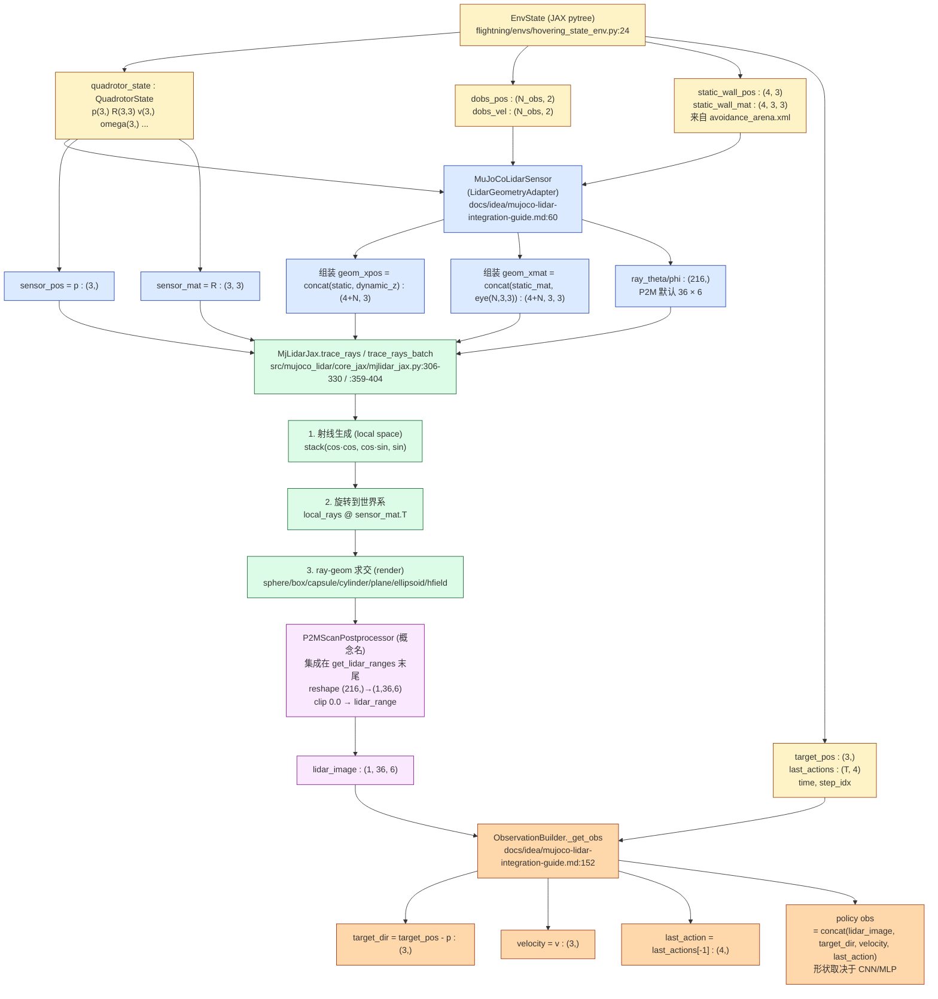

# Flightning × MuJoCo-LiDAR 接口关系说明

> 本文档梳理 P2M 动态避障任务在 Flightning 中实现时，`EnvState` → `LidarGeometryAdapter` → `MjLidarJax.trace_rays` → `P2MScanPostprocessor` → `ObservationBuilder` 这条数据链上**每个接口的具体含义、数据形态与上下游契约**，并回答"为什么 MuJoCo-LiDAR 的 wrapper 接 `mj_data`，但 JAX backend 实际只用 `geom_xpos / geom_xmat`"。

**适用阶段**：`docs/prd/p2m-dynamic-avoidance-migration.md` 落地过程中的"传感器层"设计与代码对齐。

**所有接口定义均已在源码中核对到行号**。

---

## 1. 整体数据流（mermaid）



---

## 2. 接口契约逐层说明

### 2.1 `EnvState`（Flightning 端，纯 JAX pytree）

| 字段 | 类型 | 含义 | 来源 |
|---|---|---|---|
| `time` | `float` | 仿真时间 | `hovering_state_env.py:26` |
| `step_idx` | `int` | 步进计数 | `hovering_state_env.py:27` |
| `quadrotor_state` | `QuadrotorState` | 四旋翼本体状态 | `hovering_state_env.py:28` → `quadrotor_obj.py:25-61` |
| `last_actions` | `(T, 4)` | 最近 T 个低层动作 (collective thrust + 3 body rates) | `hovering_state_env.py:33` |
| `last_quadrotor_states` | `QuadrotorState` | 最近 T 个状态（用于 delay） | `hovering_state_env.py:34` |

`QuadrotorState` 字段：`p(3,) R(3,3) v(3,) omega(3,) motor_omega domega acc dr_key`（`quadrotor_obj.py:25-61`）。

**dynamic_avoidance 扩展**（待实现，PRD 第 38-39 条）：
- `dobs_pos : (N_obs, 2)`、`dobs_vel : (N_obs, 2)`、`dobs_state : (N_obs,)` —— 动态圆柱体
- `target_pos : (3,)` —— 目标点
- `static_wall_pos / static_wall_mat` —— **不放在 EnvState 内部**，因为 4 面墙位姿来自 `avoidance_arena.xml` 且固定，由 `MuJoCoLidarSensor.__init__` 一次性抽出缓存

### 2.2 `MuJoCoLidarSensor`（即"图里的 LidarGeometryAdapter"）

**位置**：`docs/idea/mujoco-lidar-integration-guide.md:60-136`（待落地为 `flightning/sensors/mujoco_lidar_sensor.py`）。

**职责**：把 `EnvState` 喂出的标量/小张量**拼装**成 `MjLidarJax` 期望的整批 `geom_xpos / geom_xmat / sensor_pos / sensor_mat / ray_theta / ray_phi`。

**关键点**：

- **它根本不读 `mj_data`**。`mj_data` 之所以"看起来"被传进去，是因为 `MjLidarWrapper` 是个通用 API，JAX backend 内部其实只取 `mj_data.geom_xpos / geom_xmat / site(...).xpos / site(...).xmat` 四个数组（`lidar_wrapper.py:152-159`）。Flightning 直接绕过 wrapper，把这四个数组用 JAX 自己生成。
- `__init__` 阶段调 `MjLidarJax(self.model)`，**只用来抽静态 geom 元数据**（`geom_size / geom_type / hfield_data / geom_dataid`），不推进物理。
- `ray_theta / ray_phi` 由 `jnp.linspace` + `jnp.meshgrid` + `flatten` 一次性生成并缓存（`integration-guide.md:86-93`）：
  ```python
  theta = jnp.linspace(-π, π, 36, endpoint=False)        # 水平 36
  phi   = jnp.radians(jnp.linspace(-7°, 52°, 6))         # 垂直 6
  ray_theta, ray_phi = jnp.meshgrid(theta, phi)
  self.ray_theta = ray_theta.flatten()                   # (216,)
  self.ray_phi   = ray_phi.flatten()
  ```

**`get_lidar_ranges` 接口**：
```python
def get_lidar_ranges(
    self,
    drone_pos: jax.Array,        # (3,)   ← EnvState.quadrotor_state.p
    drone_mat: jax.Array,        # (3, 3) ← EnvState.quadrotor_state.R
    dobs_pos:  jax.Array,        # (N_obs, 2) ← EnvState.dobs_pos
    dobs_height_center: float = 1.5,
    stop_gradient: bool = False,
) -> jax.Array:                 # (216,) 一维距离向量
```

**两个梯度模式**（PRD 第 16 条）：
- `stop_gradient=False`（默认，analytic_lidar_grad）：完整可微，梯度通过 LiDAR 像素反传到 `drone_pos` 和 `dobs_pos`
- `stop_gradient=True`（D.VA 风格）：在求交前 `jax.lax.stop_gradient(drone_pos / drone_mat / dobs_pos)`，策略仍能看到深度图，但无视觉梯度回流

### 2.3 `geom_xpos` / `geom_xmat` —— MuJoCo 的"几何实例状态"

> **这是整个集成方案最关键的概念**

| 字段 | 来源 | 形状 | 含义 |
|---|---|---|---|
| `geom_xpos` | `mj_data.geom_xpos` | `(ngeom, 3)` | 每个 geom 的**世界坐标** (x, y, z)。MuJoCo 在 `mj_step` 之后由前向动力学 + body→geom 的相对位姿计算出来。 |
| `geom_xmat` | `mj_data.geom_xmat` | `(ngeom, 9)` 或 `(ngeom, 3, 3)` | 每个 geom 的**世界旋转矩阵**。MuJoCo 默认存成行优先 flatten 的 9 维（reshape 成 3×3 即可）。`MjLidarJax.render:151-152` 有兼容处理：`if ndim==2 and shape[-1]==9: reshape(-1, 3, 3)`。 |

**为什么 MjLidarJax 只需要这两个？** 看 `render` 方法（`mjlidar_jax.py:130-304`）：

> ray–sphere / box / capsule / cylinder / plane / ellipsoid / hfield 的求交公式，**全部只需** "几何中心位置 + 旋转 + size" 这三件套。

MuJoCo 的 body 层级、joint 约束、接触力等等对求交完全没用 —— `MjLidarJax` 把"几何外形"在 `__init__` 阶段从 `model.geom_size / geom_type / hfield_data` 抽出作为**静态**参数缓存，把"几何位姿" `geom_xpos / geom_xmat` 留作**动态**输入。这正是"**解耦物理与渲染**"的实现点：

> Flightning 用自研 Quadrotor 动力学推进 `quadrotor_state.p, R`，然后**自己拼** `geom_xpos/geom_xmat`（墙来自 XML，动态圆柱体来自 `dobs_pos + z`），再喂给 `MjLidarJax` —— MuJoCo 的 `mj_step` 一次都不需要跑。

### 2.4 `MjLidarJax.trace_rays` / `trace_rays_batch`

**位置**：`src/mujoco_lidar/core_jax/mjlidar_jax.py:306-330`（单）/ `:359-404`（batch）。

**签名**（两个方法完全对称，区别仅在 batch 维）：

```python
def trace_rays(
    geom_xpos,   # (Ngeom, 3)        或 batch 形态 (B, Ngeom, 3)
    geom_xmat,   # (Ngeom, 9) or (Ngeom, 3, 3)
    sensor_pos,  # (3,)              (B, 3)
    sensor_mat,  # (3, 3)            (B, 3, 3)
    ray_theta,   # (Nrays,)          水平角
    ray_phi,     # (Nrays,)          垂直角
) -> tuple[distances, local_rays]
    # distances : (Nrays,) 或 (B, Nrays)
    # local_rays: 同形 (JIT 时一并返回，给 get_hit_points 用)
```

**内部三步**（`mjlidar_jax.py:319-329`）：

1. **射线生成（local space）**：
   ```python
   x = cos(phi) · cos(theta)
   y = cos(phi) · sin(theta)
   z = sin(phi)
   local_rays = stack([x, y, z], axis=-1)  # (Nrays, 3)
   ```
2. **旋转到世界系**：`world_rays = local_rays @ sensor_mat.T`
3. **调 `self.render(geom_xpos, geom_xmat, sensor_pos, world_rays)`** 做 ray-geom 求交

**`trace_rays_batch` 优化**（`mjlidar_jax.py:384-403`）：
- `ray_theta / ray_phi` 在 vmap **外**算一次（避免每个 env 重算三角函数）
- `local_rays` 用 `jnp.broadcast_to` 复制到 batch
- 用 `jax.vmap(self.render)` 平行展开

**`render` 内部按 geom 类型分流**（7 类）：
| 优先级 | geom 类型 | 求交函数 | 静态元数据来源 |
|---|---|---|---|
| 1 | `mjGEOM_SPHERE` (2) | `ray_sphere_intersection` | `geom_sizes[id, 0]` 半径 |
| 2 | `mjGEOM_BOX` (6) | `ray_box_intersection` | `geom_sizes[id]` 半边长 |
| 3 | `mjGEOM_CAPSULE` (3) | `ray_capsule_intersection` | size[0]=半径, size[1]=半高 |
| 4 | `mjGEOM_CYLINDER` (5) | `ray_cylinder_intersection` | 同上 |
| 5 | `mjGEOM_PLANE` (0) | `ray_plane_intersection` | `geom_sizes[id]` |
| 6 | `mjGEOM_ELLIPSOID` (4) | `ray_ellipsoid_intersection` | `geom_sizes[id]` 半轴 |
| 7 | `mjGEOM_HFIELD` (1) | `ray_hfield_intersection` | `hfield_data / hfield_nrow/ncol / hfield_sizes` |

每类内部用 `jax.lax.scan` 逐 geom 累计取 `jnp.minimum` —— **最近的命中距离 = 该射线总距离**。

**未命中处理**（`mjlidar_jax.py:301-302`）：
```python
distance = jnp.where(jnp.isinf(min_dist), 0.0, min_dist)
return distance
```
**注意**：未命中返回 `0.0`，**不是** `inf` 也不是 `lidar_range`。下游 `get_lidar_ranges` 末尾需要 `where(ranges == 0.0, lidar_range, ranges)` 把它"撑到"最大量程（10m）。

### 2.5 `P2MScanPostprocessor` → `(1, 36, 6)`（**这个类名是图里的占位语义，不是源码类**）

**澄清**：
- 智能搜索 `P2MScanPostprocessor` 在整个 workspace 0 命中（`smart_search` 已确认），证明它是 PRD / 草图里的概念名，**不是已存在的类**
- P2M 自身的 LiDAR 物理参数是 36×6：水平 36 rays × 垂直 6 rays = 216 rays，水平 FOV 360°、垂直 FOV [-7°, 52°]（来自 PRD 第 48 条）
- P2M 的 `src/lidar/src/raycast.cpp` 是 C++ ROS 节点，**不在训练路径里**（`Out of Scope` 第 106 条明确禁止迁移 ROS / C++ raycast）

**文档里的"postprocessor"等价物**（集成方案 `get_lidar_ranges` 末尾）：
1. `ranges` 是 `(216,)` 一维向量
2. `where(ranges == 0.0, lidar_range, ranges)` 把"未命中 0.0"还原成"最大量程 10m"
3. reshape 成 `(1, 36, 6)`（前置 batch 维 1 给 CNN 用）

**建议落地**：`flightning/sensors/p2m_scan_postprocessor.py`，把 `(216,) → (1, 36, 6)` + `lidar_range` clip + 可选 `stop_gradient` 打包成 `@jax.jit` 函数。

### 2.6 `ObservationBuilder` → `policy obs`（PRD 第 42 条）

**契约**（来自 `integration-guide.md:152-174` + PRD 第 119 条）：

```python
def _get_obs(self, state: EnvState, stop_gradient: bool = False) -> jax.Array:
    lidar_ranges = self.lidar_sensor.get_lidar_ranges(    # (216,)
        drone_pos=state.quadrotor_state.p,
        drone_mat=state.quadrotor_state.R,
        dobs_pos=state.dobs_pos,
        stop_gradient=stop_gradient,
    )
    target_direction = state.target_pos - state.quadrotor_state.p  # (3,)
    velocity         = state.quadrotor_state.v                      # (3,)
    last_action      = state.last_actions[-1]                       # (4,)
    return jnp.concatenate([
        lidar_ranges,     # (216,)
        target_direction, # (3,)
        velocity,         # (3,)
        last_action,      # (4,)
    ])
```

**关键点**：
- `last_action` 是 `state.last_actions[-1]`（上一时刻低层 4 维动作：collective thrust + 3 body rates），**不是** P2M 的 acceleration command（PRD 第 119 条明确）
- 总维度 = 216 + 3 + 3 + 4 = **226 维**（flatten 后），或 reshape 后用 `(1, 36, 6) + 10` 元组喂 CNN
- 实现位置：`flightning/envs/dynamic_avoidance_env.py:DynamicAvoidanceEnv._get_obs`（待实现）

---

## 3. 核心问题：为什么 wrapper 接 `mj_data`、JAX backend 只用 `geom_xpos / geom_xmat`

### 3.1 答案

**API 形态复用** + **JAX 路径只取四个数组** + **Flightning 根本不用 wrapper**。

### 3.2 详细解释

**(1) API 形态复用**

`MjLidarWrapper` 是 CPU / Taichi / JAX 三 backend 的统一入口。CPU 与 Taichi 实现需要 `mj_data`：
- Taichi 要做 `ti.ndarray.from_numpy`（`lidar_wrapper.py:168-181`）
- CPU 要 `update(mj_data)` 把 host 端物理状态拷进 backend

所以签名统一带 `mj_data`。**这不是 JAX 路径的本质需求。**

**(2) JAX 路径只取四个数组**

看 `lidar_wrapper.py:152-159`：

```python
if self.backend == "jax":
    self.update_sensor_pose(mj_data, target_site)         # 读 site.xpos / site.xmat
    self._distances, self._local_rays = self._backend_instance.trace_rays(
        mj_data.geom_xpos,                                 # ← (ngeom, 3)
        mj_data.geom_xmat,                                 # ← (ngeom, 9)
        mj_data.site(target_site).xpos,                    # ← (3,)
        mj_data.site(target_site).xmat.reshape(3, 3),      # ← (3, 3)
        ray_theta,
        ray_phi,
    )
```

其它 `qpos / qvel / actuator / contact` 字段在 JAX 分支里**根本没被读**。

**(3) Flightning 根本不用 wrapper**

集成方案跳过 `MjLidarWrapper`，直接：

```python
self.model = mujoco.MjModel.from_xml_path(xml_path)   # ← 只用 model
self.lidar = MjLidarJax(self.model)                   # ← 抽静态 geom 元数据
...
ranges, _ = self.lidar.trace_rays(                    # ← 用 JAX 数组直接调
    geom_xpos=geom_xpos,
    geom_xmat=geom_xmat,
    sensor_pos=drone_pos,
    sensor_mat=drone_mat,
    ray_theta=self.ray_theta,
    ray_phi=self.ray_phi,
)
```

`self.model` 在 `__init__` 阶段只被用来抽 `geom_size / geom_type / hfield_data` 等**静态**属性，**不是用来推进物理的**。

**(4) `geom_xpos / geom_xmat` 的本质**

是 "geom 的世界 SE(3)" —— `mj_forward / mj_step` 之后 MuJoCo 写回 `mjData` 的派生量。`MjLidarJax.render` 的求交函数签名一致要 `pos: (3,), rot: (3, 3), size` 三件套 —— 所以你**直接拿 JAX 数组喂进去**就行，根本不需要 mj_step 把数据填到 mjData 里。

---

## 4. 数据流追踪（关键源位置）

| 接口 | 定义位置 | 接收方调用位置 |
|---|---|---|
| `EnvState` (Flightning) | `flightning/envs/hovering_state_env.py:24-34` | `flightning/envs/hovering_state_env.py:HoveringStateEnv.reset/_step` |
| `QuadrotorState` (p, R, v, omega) | `flightning/objects/quadrotor_obj.py:25-61` | `EnvState.quadrotor_state` 字段 |
| `MuJoCoLidarSensor.get_lidar_ranges` | `docs/idea/mujoco-lidar-integration-guide.md:60-136` | `dynamic_avoidance_env._get_obs`（待实现） |
| `MjLidarJax.__init__`（抽静态 geom 元数据） | `MuJoCo-LiDAR/src/mujoco_lidar/core_jax/mjlidar_jax.py:21-128` | `MuJoCoLidarSensor.__init__` |
| `MjLidarJax.render`（核心求交） | 同上 `:130-304` | `MjLidarJax.trace_rays:329` |
| `MjLidarJax.trace_rays`（JIT 入口） | 同上 `:306-330` | `MuJoCoLidarSensor.get_lidar_ranges:123` |
| `MjLidarWrapper.trace_rays`（JAX 分支） | `MuJoCo-LiDAR/src/mujoco_lidar/lidar_wrapper.py:146-161` | **Flightning 路径不调用它** |
| `_get_obs`（ObservationBuilder） | `integration-guide.md:152-174` | `Env.step → EnvTransition.obs` (`env_base.py:34-56`) |
| P2M 默认 LiDAR 参数 | `docs/prd/p2m-dynamic-avoidance-migration.md:48` | `MuJoCoLidarSensor.__init__` 内 `linspace` 计算 |
| `geom_xpos / geom_xmat` 在 MuJoCo 的语义 | `mujoco.MjData` 派生量 | `mj_step` 之后由前向动力学写回 |

---

## 5. 风险与待澄清项（基于源码核对）

| # | 风险 | 现状 | 应对 |
|---|---|---|---|
| 1 | `(1, 36, 6)` 的 batch 维 1 | `trace_rays_batch` 期望 `(B, Ngeom, 3)` | 单 env 走 batch 形式需在 `get_lidar_ranges` 里 `jnp.expand_dims(..., 0)` |
| 2 | `geom_xmat` 形状歧义 | `render:151` 与 `:354` 同时支持 9 维展平与 3×3 | 集成方案用 `eye(3)` tile 出 `(N, 3, 3)`，与源码一致；若以后引入姿态非平凡的动态 geom，需替换为真实旋转 |
| 3 | `mj_data` 依赖深浅 | `MjLidarJax.__init__` 读 `model.geom_type / geom_size / hfield_data / geom_dataid / geom_bodyid` | **仍然需要 mujoco Python 包和一份合法 XML** —— 只是不需要 `mj_step` 跑过 |
| 4 | `(Ngeom, 3, 3)` 与 `(Ngeom, 9)` 兼容性 | `render` 用 `if ndim == 2 and shape[-1] == 9: reshape` | 当前示例是 3×3 形态，不会触发 reshape 分支；安全 |
| 5 | P2MScanPostprocessor 是概念名 | 源码中无对应类 | 落地时新建 `flightning/sensors/p2m_scan_postprocessor.py`，把 `(216,) → (1, 36, 6)` + `lidar_range` clip 打包 |
| 6 | 未命中返回 `0.0` 而非 `lidar_range` | `mjlidar_jax.py:301-302` | 集成方案 `integration-guide.md:133` 已用 `where(ranges == 0.0, lidar_range, ranges)` 修正 |
| 7 | `dobs_state` 状态机细节 | PRD 第 51、120、123-125 条明确 source-pending | 等待用户提供 P2M 源码后再对齐 |

---

## 6. 与 PRD 决策的对应关系

| PRD 条目 | 本文档对应章节 |
|---|---|
| 第 38-39 条（EnvState 字段） | § 2.1 |
| 第 40 条（LiDAR 射线方向生成） | § 2.2（`ray_theta / ray_phi`） |
| 第 41 条（LiDAR 距离图模块） | § 2.2、§ 2.3、§ 2.4 |
| 第 42 条（Observation Builder） | § 2.6 |
| 第 45 条（双视觉梯度模式） | § 2.2（`stop_gradient`） |
| 第 48 条（P2M 默认 LiDAR 参数） | § 2.2（`linspace(36) / linspace(6, FOV=[-7°, 52°])`） |
| 第 53 条（解析 LiDAR 梯度方向） | § 2.3、§ 2.4、§ 3.2 |
| 第 119 条（last_action 语义） | § 2.6 |

---

## 7. 一句话总结

> **`geom_xpos / geom_xmat` 是 MuJoCo 物理推进到 `mjData` 之后的"geom 世界位姿派生量"，但 MjLidarJax 把它当作纯数学输入 —— 所以 Flightning 完全可以"跳过 MuJoCo 物理引擎，直接用 JAX 拼这两个矩阵"喂给 `MjLidarJax.trace_rays`，`MjLidarWrapper` 接 `mj_data` 只是三 backend API 复用造成的接口层冗余，不是 JAX 路径的真实依赖。**

---

## 8. 引用源

- 集成方案：`/home/tong/tongworkspace/paperworkspace/rpg_flightning/docs/idea/mujoco-lidar-integration-guide.md`
- PRD：`/home/tong/tongworkspace/paperworkspace/rpg_flightning/docs/prd/p2m-dynamic-avoidance-migration.md`
- MjLidarJax 源码：`/home/tong/.gitnexus/repos/MuJoCo-LiDAR/src/mujoco_lidar/core_jax/mjlidar_jax.py`
- MjLidarWrapper 源码：`/home/tong/.gitnexus/repos/MuJoCo-LiDAR/src/mujoco_lidar/lidar_wrapper.py`
- EnvState 定义：`/home/tong/tongworkspace/paperworkspace/rpg_flightning/flightning/envs/hovering_state_env.py:24-34`
- EnvState 基类：`/home/tong/tongworkspace/paperworkspace/rpg_flightning/flightning/envs/env_base.py:26-28`
- QuadrotorState 定义：`/home/tong/tongworkspace/paperworkspace/rpg_flightning/flightning/objects/quadrotor_obj.py:25-61`
