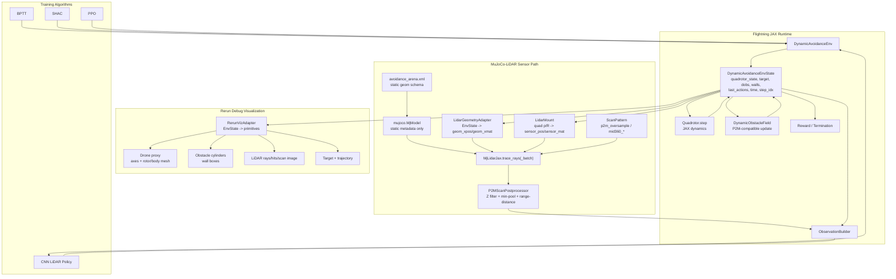

## Context

P2M 的动态避障任务目前由 Isaac Sim/Torch/ROS/NeuFlow 组合实现。Flightning 当前环境接口以 JAX pytree `EnvState` 为运行时状态，`Env.step`/`reset` 通过 JIT 和 `lax.scan` 被 BPTT/SHAC 调用。新增动态避障能力必须保持这个边界：训练运行时不能依赖 Python-side MuJoCo `mjData` 或 MuJoCo `mj_step`，否则会破坏 JAX 可微 rollout 和批量化。

MuJoCo-LiDAR 的 JAX backend 需要一个合法 `mujoco.MjModel` 进行初始化，以提取 geom 类型、大小、hfield 等静态 metadata；运行时 raycast 的直接数组接口需要 `geom_xpos`、`geom_xmat`、`sensor_pos`、`sensor_mat`、`ray_theta`、`ray_phi`。因此本设计把 MuJoCo/MJCF 限定为 LiDAR 几何 schema 来源，而不是 Flightning 的物理状态来源。

无人机和动态障碍物当前没有 MJCF/Isaac USD 模型。为了满足“视觉上看到无人机在障碍物中飞行”的调试需求，本设计新增 Rerun 调试级仿真可视化。Rerun 直接渲染 Flightning EnvState 的可视化代理，不参与训练、不参与 LiDAR 碰撞语义、不定义状态。

## Goals / Non-Goals

**Goals:**

- 新增 `DynamicAvoidanceEnv`，通过 Flightning `Env` API 支持 BPTT/SHAC/PPO 的 JAX rollout。
- 严格复刻 P2M 第一版动态障碍物语义：`pos_xy`、`vel_xy`、`radius`、`hit/state`，触边后按 `random >= trace_prob` 选择追踪或反射，再执行 `pos_xy += vel_xy * dt`。
- 通过 `MjLidarJax` 直接数组接口实现 LiDAR raycast，第一版只承诺 JAX backend 已支持且能由 Flightning state 直接提供 pose 的几何体。
- 复刻 P2M 默认 LiDAR 图像语义：`lidar_range=10`、`36x6`、`3x3` 超采样、垂直 FOV `[-7, 52]`、Z 过滤、min-pool、`lidar_range - distance`。
- 提供调试级 Rerun 可视化，显示无人机代理、障碍物 cylinder、墙体 box、目标、轨迹、LiDAR rays/hits 和 scan image。
- 用数值对齐测试和 BPTT smoke test 验证环境、传感器、动态障碍物和训练接口。

**Non-Goals:**

- 不接入 MuJoCo `mjData` 作为 Flightning runtime state。
- 不使用 MuJoCo 正向运动学、`mj_step` 或任意 MJCF kinematics 驱动无人机/障碍物。
- 不承诺 mesh raycast、任意 MJCF 场景、photorealistic renderer 或 Isaac/MuJoCo 级视觉效果。
- 不迁移 P2M 的 Torch PPO、ROS raycast C++ 节点、NeuFlow 外部推理、acceleration controller 或 flatten LiDAR + MLP 策略。
- 不把 Rerun 视觉代理作为动力学、LiDAR 碰撞或 reward 语义来源。

## Requirements

### Functional

- 环境 reset 生成无人机、目标、动态障碍物、墙体和 last_action 初始状态。
- 环境 step 裁剪 action，更新 last_action，调用 Flightning quadrotor 动力学，更新动态障碍物，构建 LiDAR 图像和策略观测，计算 reward/termination。
- LiDAR adapter 从 Flightning state 构造 `geom_xpos`/`geom_xmat` 和 `sensor_pos`/`sensor_mat`，直接调用 `MjLidarJax.trace_rays` 或 `trace_rays_batch`。
- Rerun adapter 从 EnvState 记录调试可视化，不阻塞训练，不要求 viewer 常驻。
- 测试覆盖 P2M 数值对齐、JIT/vmap/scan、BPTT gradient smoke、Rerun logging smoke。

### Non-Functional

- **可微性**：默认 `analytic_lidar_grad` 允许 LiDAR 观测梯度经 `MjLidarJax` 回到 Flightning `EnvState`，服务于 BPTT/SHAC 传统可微仿真路线；`stop_lidar_grad` 仅作为稳定性对照，不实现 D.VA 解耦训练。
- **性能**：动态避障 rollout 必须可 JIT、可 `vmap`，避免在 `_step` 动态路径调用 Python/MuJoCo mutable object。
- **可维护性**：区分物理语义、LiDAR 碰撞几何和可视化资产，避免三者互相定义。
- **可观测性**：Rerun 可视化应能复现实验轨迹和关键传感器输出。
- **兼容性**：不修改现有 hovering 环境和 `algos/` 公共接口。

## High-Level Architecture

## Component Responsibilities

| Layer | Upstream Caller | Owned Responsibility | Module Location | Explicit Exclusions |
|-------|-----------------|----------------------|-----------------|---------------------|
| `DynamicAvoidanceEnv` | BPTT/SHAC/PPO, examples | Flightning Env API, state lifecycle, action clipping, reward/termination orchestration | `flightning/envs/dynamic_avoidance_env.py` | 不定义 LiDAR raycast internals；不定义 policy architecture |
| `DynamicObstacleField` | `DynamicAvoidanceEnv._step/reset` | P2M-compatible dynamic obstacle init/update and PRNG use | `flightning/modules/dynamic_obstacle_field.py` | 不调用 MuJoCo/Isaac physics；不做 Rerun logging |
| `LidarGeometryAdapter` | LiDAR sensor wrapper | EnvState -> `geom_xpos`/`geom_xmat` for supported JAX backend geoms | `flightning/sensors/mujoco_lidar_sensor.py` | 不生成 visual-only mesh；不 run `mj_forward` |
| `LidarMount` | LiDAR sensor wrapper | `quadrotor_state.p/R` -> `sensor_pos`/`sensor_mat`，支持 yaw-only | `flightning/sensors/mujoco_lidar_sensor.py` | 不改变 quadrotor dynamics |
| `P2MScanPostprocessor` | LiDAR sensor wrapper | P2M scan image postprocess and gradient mode control | `flightning/sensors/mujoco_lidar_sensor.py` | 不定义 reward |
| `ObservationBuilder` | Env | LiDAR image + target direction + velocity + last_action fusion | `flightning/modules/observation_builder.py` | 不编码 CNN |
| `CNN LiDAR Policy` | Training examples | LiDAR CNN encoder and action head | `flightning/modules/cnn_lidar_policy.py` | 不修改 BPTT/SHAC/PPO |
| `RerunVizAdapter` | Examples/tests/manual debug | EnvState -> Rerun primitives and timelines | `flightning/visualization/rerun_dynamic_avoidance.py` | 不参与 training graph；不定义 collision/reward |

## Decisions

### ADR-001: Use Flightning EnvState as Runtime Truth

**Status:** Accepted

**Context:** Flightning training algorithms run env step inside JAX JIT/vmap/scan. MuJoCo `mjData` is a mutable simulation state/workspace and is not a JAX pytree training state.

**Decision:** Dynamic avoidance runtime state is defined only by `DynamicAvoidanceEnvState`. MuJoCo `mjData` is not used in `_step`, BPTT, SHAC or PPO rollout.

**Alternatives Considered:**

- **Synchronize Flightning state into `mjData` each step**: rejected because it introduces Python-side mutable state and breaks JAX scan/BPTT assumptions.
- **Make MuJoCo the physics backend**: rejected because this change is specifically about Flightning JAX differentiable simulation.

**Consequences:**

- Positive: Keeps end-to-end differentiability and algorithm compatibility.
- Negative: Arbitrary MJCF kinematics are not available unless separately reimplemented as JAX pose adapters.

### ADR-002: Directly Use `MjLidarJax` Array Interface

**Status:** Accepted

**Context:** MuJoCo-LiDAR wrapper accepts `mjData`, but the JAX backend ultimately consumes geometry pose arrays and sensor pose arrays.

**Decision:** Create a Flightning LiDAR wrapper that initializes `MjLidarJax` from `mujoco.MjModel` metadata, then calls `trace_rays`/`trace_rays_batch` directly with `geom_xpos`, `geom_xmat`, `sensor_pos`, `sensor_mat`, `ray_theta`, and `ray_phi`.

**Alternatives Considered:**

- **Use `MjLidarWrapper.trace_rays(mj_data, ...)`**: rejected for training runtime because it requires `mjData` and site lookup.
- **Implement all raycasting from scratch**: rejected because MuJoCo-LiDAR already provides a JAX backend for supported primitive geometry.

**Consequences:**

- Positive: Keeps JAX-compatible sensor path and avoids fake `mjData`.
- Negative: First version is limited to JAX backend supported geometry with explicit Flightning-provided pose.

### ADR-003: Strictly Reproduce P2M Dynamic Obstacle Trace Semantics

**Status:** Accepted

**Context:** P2M's `trace_prob` implementation uses `random >= trace_prob` to choose trace velocity on boundary contact. The field name suggests the opposite behavior, but alignment tests should reflect source behavior.

**Decision:** Implement the same behavior and document the naming mismatch.

**Alternatives Considered:**

- **Rename/reinterpret `trace_prob` to intuitive probability**: rejected because it would silently diverge from P2M reference behavior.
- **Drop trace behavior**: rejected because dynamic obstacle behavior is part of the migration target.

**Consequences:**

- Positive: Enables deterministic P2M alignment tests.
- Negative: Users may misread the parameter without documentation.

### ADR-004: Use Rerun for Debug-Level Visualization Only

**Status:** Accepted

**Context:** The project needs to visually inspect a drone flying among obstacles, but current drone/obstacle models are not MJCF/Isaac assets.

**Decision:** Rerun visualizes EnvState with lightweight proxies: drone axes/body/rotors, obstacle cylinders, wall boxes, target point, trajectory, LiDAR rays/hits and scan image.

**Alternatives Considered:**

- **Require MJCF/URDF/Isaac assets before visualization**: rejected because it delays useful debugging and conflates visual assets with state semantics.
- **Use MuJoCo viewer for rendering**: rejected because runtime state is not MuJoCo `mjData`.

**Consequences:**

- Positive: Immediate state-faithful visualization for debugging and demos.
- Negative: Visual fidelity is lower than MuJoCo/Isaac rendering; aesthetics are not a correctness signal.

## Data Flow

1. `reset(key)` samples drone, target and dynamic obstacle state.
2. `_step(state, action, key)` clips action and updates quadrotor with Flightning dynamics.
3. Dynamic obstacle field updates `vel_xy` on boundary/trace rule and advances `pos_xy`.
4. LiDAR geometry adapter maps walls and dynamic obstacle cylinders to `geom_xpos`/`geom_xmat`.
5. LiDAR mount maps `quadrotor_state.p/R` to yaw-only `sensor_pos`/`sensor_mat`.
6. `MjLidarJax` returns ray distances.
7. P2M scan postprocessor applies Z filtering, min-pool, range inversion and gradient mode.
8. Observation builder returns policy input.
9. Reward/termination use state, scan image and P2M-inspired safety/dynamic obstacle terms.
10. Optional Rerun adapter records the same state and sensor outputs on a timeline.

## Risks / Trade-offs

| Risk | Mitigation |
|------|------------|
| `trace_prob` naming conflicts with behavior | Preserve P2M behavior and document `random >= trace_prob` explicitly in config/spec/tests |
| LiDAR JAX backend geometry support differs from Taichi backend | First version only accepts JAX-supported geometry with Flightning-provided pose; mesh/MJCF kinematics remain out of scope |
| Rerun visual proxies are mistaken for physics/collision geometry | Keep visualization module separate and document it as debug-only |
| Analytic LiDAR gradients may be unstable around ray/geometry discontinuities | Provide `stop_lidar_grad` mode and BPTT smoke tests for finite/nonzero gradients |
| 1944 or 24000 rays may be expensive for large batches | Default to `p2m_oversample`; keep `mid360_livox` optional; benchmark after implementation |
| Existing training wrappers expect flat arrays | Observation builder and policy must define stable shapes; tests cover BPTT/SHAC/PPO compatibility |

## Migration Plan

1. Add modules without modifying existing hovering environments or training algorithms.
2. Add focused tests for dynamic obstacle update, LiDAR geometry adapter, P2M scan postprocessing and Rerun logging smoke.
3. Add `DynamicAvoidanceEnv` and run JIT/vmap/scan tests.
4. Add CNN LiDAR policy and BPTT smoke training.
5. Add example notebook/script for training and optional Rerun visualization.
6. Keep rollback simple: remove new files/dependencies; existing Flightning behavior remains untouched.

## Open Questions

- 是否需要在第一版 examples 中提供一个非 notebook 的 headless Rerun `.rrd` 导出脚本，方便远程服务器上离线查看？
- `mid360_livox` 是否进入第一版验收，还是只保留接口并把性能/对齐测试推迟到后续 change？
